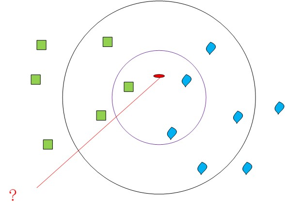
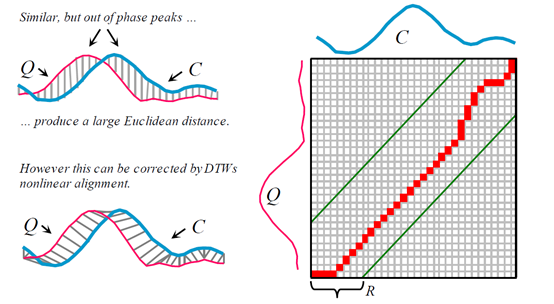
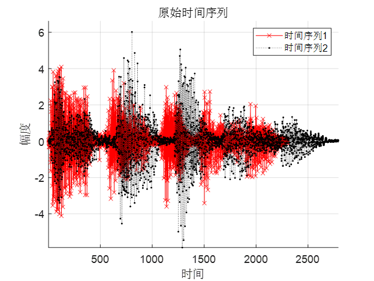
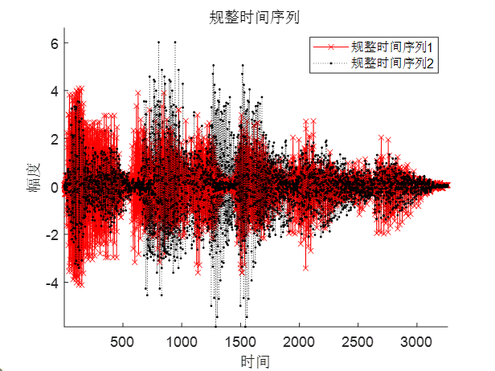

# DTW-KNN-Matlab  
DTW-KNN算法实现（Matlab）

---
# 文件分布：  
### train.m：主文件，运行即可  
### 其他：函数等  

---
## KNN算法原理：
KNN算法的思想就是计算样本与训练集中向量差的范数，找出范数最小的K个值，决定样本应该分类到哪里。KNN属于有监督算法。

## DTW原理：
DTW（Dynamic Time Warping，动态时间规整）的出发点是比较两个时间序列的相似程度，其基本思想把两个时间序列分别对应的时间“扭曲(Warping，或称规整)”并实现对齐，如下图：

  

图中右半部分就是进行DTW的直观过程，该矩阵为待比较的时间序列Q与C之间的距离匹配矩阵（即各个时间点之间对应的序列点距离），DTW就是找到一条从出发点到结束点的最短路径，寻找最短路径的过程也叫做动态规划。  
## 数据预处理：
由于DTW算法计算量大，因此需要通过预处理降低音频序列维度并提取特征点，因此，本实验主要实验步骤为：
1.	转化为单声道，降采样至8 kHz。
2.	分帧加窗，VAD（语音端点检测，采用短时能量法）。
3.	DTW计算序列距离。
4.	KNN进行结果匹配。

## DTW结果分析：
这里的图片展示主要用途为原理讲解，不代表实际使用情况。  
进行DTW前的时间序列（相同孤立词），二者相似度并不高：

  

进行DTW之后的规整时间序列（相同孤立词），二者相似度提高很多，且二者与原来时间序列相比，其形状几乎不变：

  

## DTW-KNN模型正确率
### 本次实验为91.7%，包含变异语音
可以看到，DTW实现简单，且在处理特定人语音识别时效果很好。但在处理非特定人语音识别问题方面表现不太好，使用机器学习的术语来说，就是采用DTW算法的模型泛化能力较差。另外，DTW模型需要存储所有训练数据，其空间占用量和测试耗时随训练数据量都是随文件个数而线性增长，这是实际语音转文字应用难以接受的。  
需要注意，DTW的泛化能力差不一定代表其用途不大，相反，DTW在声纹识别方面具有一定的优势。  
在语音识别发展过程中，DTW泛化能力差、运算量大和模型空间占用大也是催生出其他适用于非特定人语音识别的机器学习算法（如HMM、神经网络等）的主要原因之一。  

 
